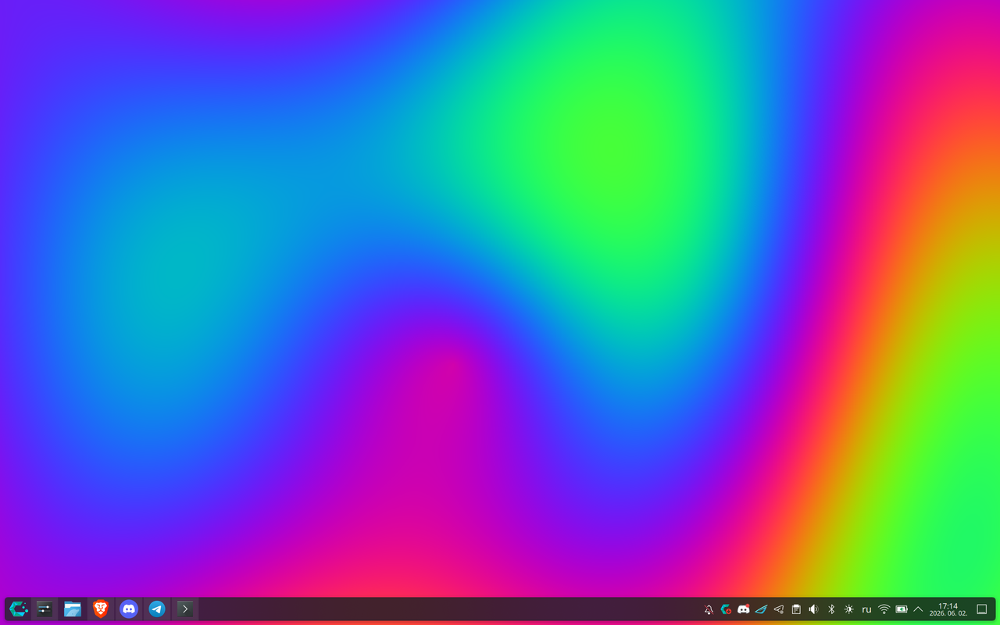
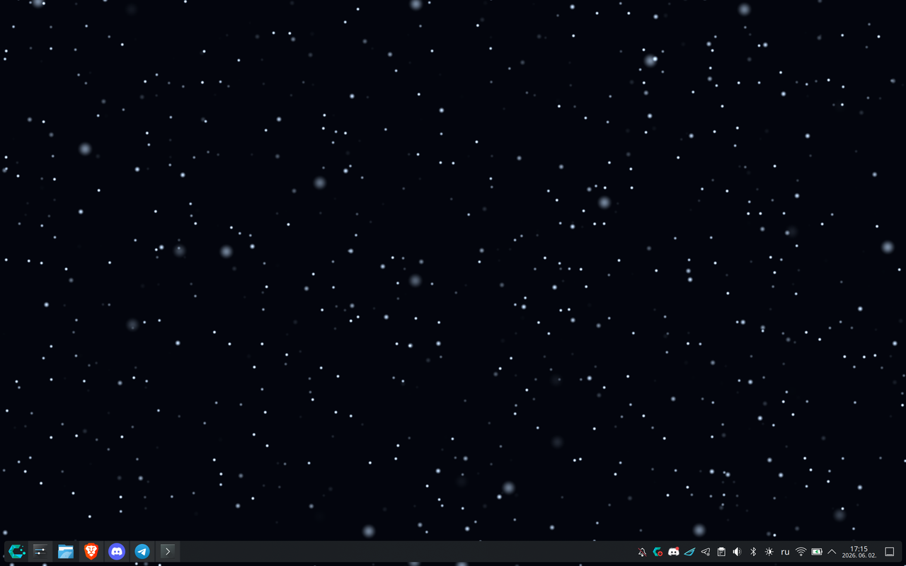
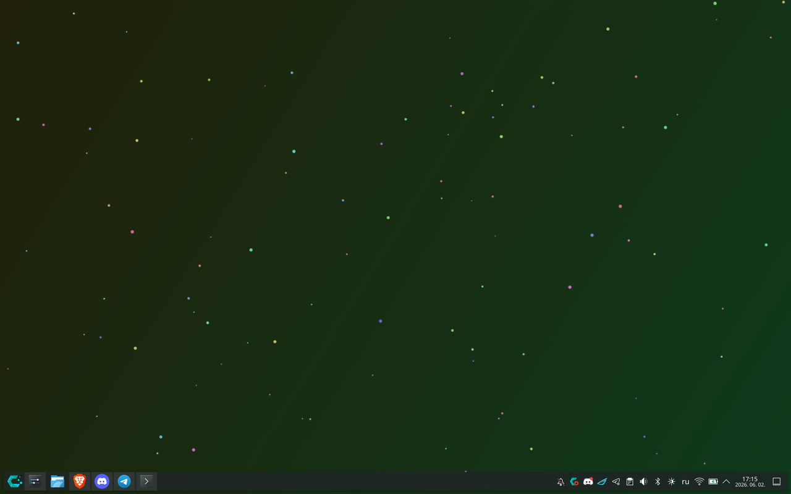
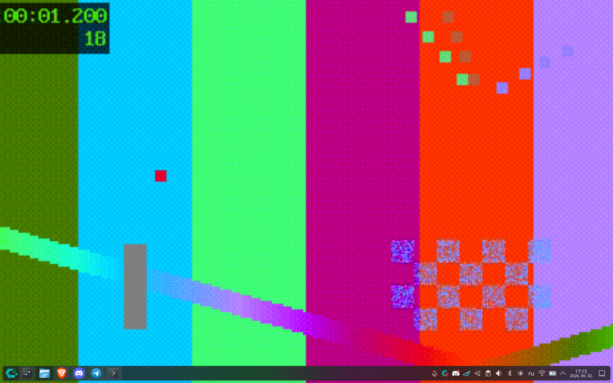

# KOpenWallpaper

Animated, living wallpapers for **KDE Plasma 6** — an open-source Wallpaper
Engine alternative. Each wallpaper type is a native *Plasma wallpaper plugin*:
it shows up under **Wallpaper Type**, renders on every monitor and is managed by
Plasma itself (no extra daemon, no separate window).

> **Status: v0.2** — four working wallpaper types:
>
> | Plugin  | Id                                 | Content |
> |---------|------------------------------------|---------|
> | **Video**  | `com.github.kopenwalpaper.video`  | mp4 / webm / mkv / ogv / mov, looped, audio, speed |
> | **GIF**    | `com.github.kopenwalpaper.gif`    | gif / apng / animated webp |
> | **Shader** | `com.github.kopenwalpaper.shader` | procedural GLSL (plasma / waves / starfield) + **Living image** (animate any picture) + custom shaders |
> | **Web**    | `com.github.kopenwalpaper.web`    | HTML / CSS / canvas / WebGL via QtWebEngine |

## Screenshots

| Plasma | Starfield |
|---|---|
|  |  |
| **Web (particle demo)** | **GIF** |
|  |  |

> The **Living image** preset animates any picture you choose (breathing zoom,
> parallax, bokeh, chromatic aberration). No sample image is bundled — point it
> at your own wallpaper.

## Requirements

- KDE Plasma 6 (tested on 6.6, Wayland)
- Qt 6 with:
  - **QtMultimedia** (`qt6-multimedia`) + codecs — for Video
  - **QtWebEngine** (`qt6-webengine`) — for Web
  - **qt6-shadertools** (provides `qsb`) — to build the shaders
- `AnimatedImage` (GIF) and `ShaderEffect` ship with base QtQuick

## Install

```bash
git clone https://github.com/aberkunsky/kopenwalpaper.git
cd kopenwalpaper
./install.sh             # compile shaders + install ALL plugins
./install.sh video gif   # …or only the named plugins
```

Then restart the shell so the plugins are picked up:

```bash
kquitapp6 plasmashell && (plasmashell &)   # or just log out / back in
```

Right-click the desktop → **Configure Desktop and Wallpaper…** → **Wallpaper
Type** → pick a **“KOpenWallpaper (…)”** entry.

Uninstall with `./uninstall.sh` (removes all plugins).

## Wallpaper types

### Video
Pick a video file, fill mode (crop / fit / stretch), background colour, mute +
volume, playback speed. Loops forever.

### GIF
Animated image (gif / apng / webp), fill mode, background colour, animation
speed.

### Shader (GLSL)
Built-in presets: **Living image** (animates any picture you choose), **Plasma**,
**Waves**, **Starfield**, plus **Custom (.qsb)** for your own shader. A speed
control drives `iTime`; shaders receive `iTime` (s), `iResolution` (px) and
`imageAspect`, Shadertoy-style.

**Living image.** Choose the *Living image* preset and any file in the **Image**
field — the effect is applied to that picture in real time. It samples the
picture through the `source` sampler
(`layout(binding = 1) uniform sampler2D source;`); the image aspect arrives in
`imageAspect`, so it cover-fits any aspect ratio. Each effect has a 0–200 %
slider (100 % = default, 0 % = off):

- **Breathing zoom** — slow in/out breathing
- **Parallax sway** — gentle drift of the frame
- **Chromatic aberration** — RGB split toward the edges
- **Bokeh particles** — soft dots drifting upward
- **Vignette** — edge darkening

### Web
A URL (`https://…`) or a local `.html` file (empty → the bundled particle demo).
A *Mute* toggle. Point it at a local HTML/WebGL scene for animated, interactive
wallpapers.

## Writing your own shader

Qt 6 needs shaders precompiled to `.qsb`:

```bash
./compile-shaders.sh path/to/my.frag      # → my.frag.qsb
```

Every shader **must** declare the same canonical std140 block (the ShaderEffect
contract). The vertex stage uses the same block, so any mismatch fails GL
linking:

```glsl
#version 440
layout(location = 0) in vec2 qt_TexCoord0;
layout(location = 0) out vec4 fragColor;
layout(std140, binding = 0) uniform buf {
    mat4 qt_Matrix;
    float qt_Opacity;
    float iTime;
    vec2 iResolution;
    float imageAspect;
    float breatheAmount;
    float swayAmount;
    float aberration;
    float bokehAmount;
    float vignetteAmount;
};
// Image shaders also: layout(binding = 1) uniform sampler2D source;
void main() {
    vec2 uv = qt_TexCoord0;            // 0..1
    fragColor = vec4(uv, 0.5 + 0.5 * sin(iTime), 1.0) * qt_Opacity;
}
```

A paired pass-through `passthrough.vert` is bundled: under the OpenGL RHI backend
the vertex stage must export `qt_TexCoord0` at an explicit `location` matching
the fragment input, otherwise GL linking spams errors.

## Apply from the command line

```bash
qdbus6 org.kde.plasmashell /PlasmaShell org.kde.PlasmaShell.evaluateScript '
var ds = desktops();
for (var i = 0; i < ds.length; i++) { var d = ds[i];
  d.wallpaperPlugin = "com.github.kopenwalpaper.shader";
  d.currentConfigGroup = ["Wallpaper", "com.github.kopenwalpaper.shader", "General"];
  d.writeConfig("Preset", "starfield");
  d.reloadConfig(); }'
```

## Repository layout

```
plugins/
├── video/  gif/  shader/  web/
│   each: metadata.json
│         contents/config/main.xml      # config keys (KConfigXT)
│         contents/ui/main.qml          # WallpaperItem renderer
│         contents/ui/config.qml        # settings page (Kirigami.FormLayout)
│   shader/contents/shaders/*.frag,*.vert   # GLSL sources (.qsb built on install)
│   web/contents/web/demo.html
install.sh          # build shaders + install all plugins
uninstall.sh
compile-shaders.sh  # GLSL → .qsb (via qsb from qt6-shadertools)
```

## Performance / notes

Animated wallpapers can pin the GPU. The shader clock is **capped to ~30 fps**
(a Timer, not a refresh-locked `FrameAnimation`) and **pauses while the wallpaper
isn't visible**, so a full-screen shader doesn't run at 120/165 Hz forever — this
matters a lot on laptops / hybrid-GPU setups.

### Plasma 6 plugin gotchas (worth knowing if you hack on this)
- `main.qml`'s root must be a `WallpaperItem` (from `org.kde.plasma.plasmoid`);
  read config as `configuration.<Key>` (not `wallpaper.configuration`).
- `config.qml` must declare `property var configDialog` and
  `property var wallpaperConfiguration`, or the host complains on init.
- Qt 6 `ShaderEffect.fragmentShader` takes a URL to a `.qsb`, never raw GLSL.
- **Store path config keys as `type="String"`, never `type="Url"`.** The
  wallpaper KCM marshals config over D-Bus as `a{sv}`, and `QUrl` is not a
  registered D-Bus type (`QDBusMarshaller: type 'QUrl' is not registered`) →
  System Settings aborts (SIGABRT) on apply. QML coerces a string to `url` where
  needed anyway.

## Roadmap

- [ ] Pause animation when a window is maximised / fullscreen (battery saving) via `org.kde.taskmanager` TasksModel
- [ ] Audio reactivity (PipeWire → FFT → shader uniforms)
- [ ] Runtime compilation of user `.frag` files from the config page
- [ ] Preset gallery / live previews in the config UI
- [ ] Import Wallpaper Engine projects (scene.pkg)

## Contributing

See [CONTRIBUTING.md](CONTRIBUTING.md) for dev setup, testing, the shader UBO
contract, and KDE Store publishing. CI (`.github/workflows/lint.yml`) validates
manifests, compiles the shaders with `qsb`, and runs ShellCheck on every push.

## License

MIT — see [LICENSE](LICENSE).
